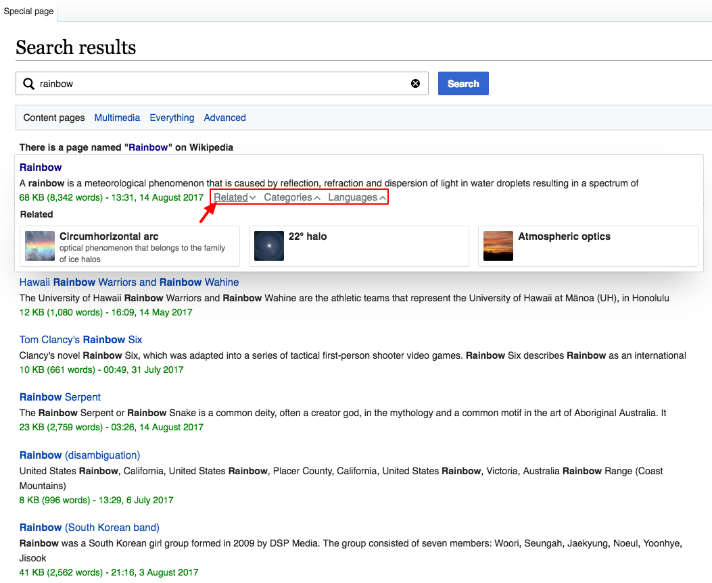

# Test of the Explore Similar Widget

This repo is the analysis and report codebase for [Discovery](https://www.mediawiki.org/wiki/Special:MyLanguage/Wikimedia_Discovery)'s [test of "explore similar" widget](https://www.mediawiki.org/wiki/Cross-wiki_Search_Result_Improvements/Testing#A.2FB_test:_Add_.27explore_similar.27_pages_and_categories_for_search_results):

See [T149809](https://phabricator.wikimedia.org/T149809), [Discovery 2017-18 Q1 goals](https://www.mediawiki.org/wiki/Wikimedia_Audiences/2017-18_Q1_Goals#Readers), and [Cross-wiki Search Result Improvements/explore similar](https://www.mediawiki.org/wiki/Cross-wiki_Search_Result_Improvements/explore_similar) for more information.

The final report can be accessed by visiting [https://wikimedia-research.github.io/Discovery-Search-Test-ExploreSimilar/](https://wikimedia-research.github.io/Discovery-Search-Test-ExploreSimilar/) and the PDF version will be made available on Wikimedia Commons once the draft has been finalized.

This work is licensed under the Creative Commons Attribution 4.0 International License, so if you see anything you like and want to use, you are welcome to do that with attribution. To view a copy of this license, visit [http://creativecommons.org/licenses/by/4.0/](http://creativecommons.org/licenses/by/4.0/).
